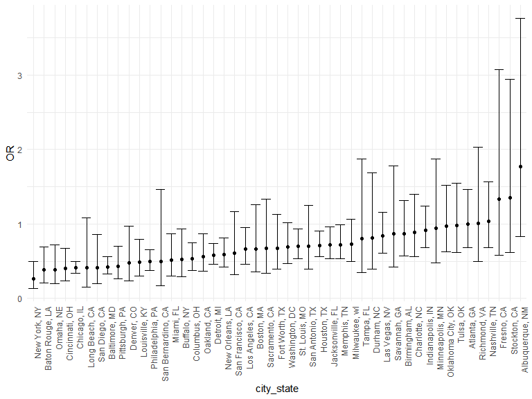
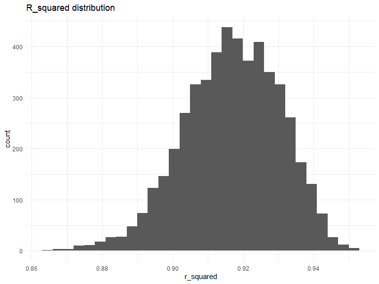
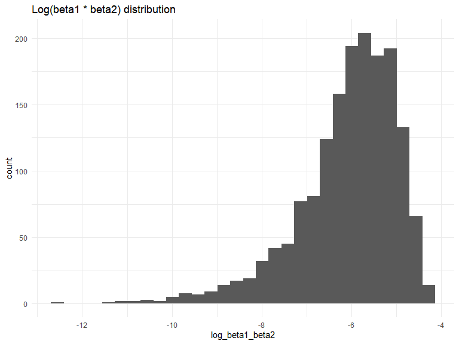

Homework 6
================
Madison Goldrich

Load key packages.

``` r
library(tidyverse)
library(modelr)

set.seed(1)
```

### Problem 1

In the data cleaning code below we create a `city_state` variable,
change `victim_age` to numeric, modifiy victim_race to have categories
white and non-white, with white as the reference category, and create a
`resolution` variable indicating whether the homicide is solved. Lastly,
we filtered out the following cities: Tulsa, AL; Dallas, TX; Phoenix,
AZ; and Kansas City, MO; and we retained only the variables
`city_state`, `resolution`, `victim_age`, `victim_sex`, and
`victim_race`.

``` r
homicide_df = 
  read_csv("data/homicide-data.csv", na = c("", "NA", "Unknown")) |> 
  mutate(
    city_state = str_c(city, state, sep = ", "),
    victim_age = as.numeric(victim_age),
    resolution = case_when(
      disposition == "Closed without arrest" ~ 0,
      disposition == "Open/No arrest"        ~ 0,
      disposition == "Closed by arrest"      ~ 1)
  ) |> 
  filter(victim_race %in% c("White", "Black")) |> 
  filter(!(city_state %in% c("Tulsa, AL", "Dallas, TX", "Phoenix, AZ", "Kansas City, MO"))) |> 
  select(city_state, resolution, victim_age, victim_sex, victim_race)
```

    ## Rows: 52179 Columns: 12
    ## ── Column specification ────────────────────────────────────────────────────────
    ## Delimiter: ","
    ## chr (8): uid, victim_last, victim_first, victim_race, victim_sex, city, stat...
    ## dbl (4): reported_date, victim_age, lat, lon
    ## 
    ## ℹ Use `spec()` to retrieve the full column specification for this data.
    ## ℹ Specify the column types or set `show_col_types = FALSE` to quiet this message.

Next we fit a logistic regression model using only data from Baltimore,
MD. We model `resolved` as the outcome and `victim_age`, `victim_sex`,
and `victim_race` as predictors. We save the output as `baltimore_glm`
so that we can apply `broom::tidy` to this object and obtain the
estimate and confidence interval of the adjusted odds ratio for solving
homicides comparing non-white victims to white victims.

``` r
baltimore_glm = 
  filter(homicide_df, city_state == "Baltimore, MD") |> 
  glm(resolution ~ victim_age + victim_sex + victim_race, family = binomial(), data = _)

baltimore_glm |> 
  broom::tidy() |> 
  mutate(
    OR = exp(estimate), 
    OR_CI_upper = exp(estimate + 1.96 * std.error),
    OR_CI_lower = exp(estimate - 1.96 * std.error)) |> 
  filter(term == "victim_sexMale") |> 
  select(OR, OR_CI_lower, OR_CI_upper) |>
  knitr::kable(digits = 3)
```

|    OR | OR_CI_lower | OR_CI_upper |
|------:|------------:|------------:|
| 0.426 |       0.325 |       0.558 |

Below, by incorporating `nest()`, `map()`, and `unnest()` into the
preceding Baltimore-specific code, we fit a model for each of the
cities, and extract the adjusted odds ratio (and CI) for solving
homicides comparing non-white victims to white victims. We show the
first 5 rows of the resulting dataframe of model results.

``` r
model_results = 
  homicide_df |> 
  nest(data = -city_state) |> 
  mutate(
    models = map(data, \(df) glm(resolution ~ victim_age + victim_sex + victim_race, 
                             family = binomial(), data = df)),
    tidy_models = map(models, broom::tidy)) |> 
  select(-models, -data) |> 
  unnest(cols = tidy_models) |> 
  mutate(
    OR = exp(estimate), 
    OR_CI_upper = exp(estimate + 1.96 * std.error),
    OR_CI_lower = exp(estimate - 1.96 * std.error)) |> 
  filter(term == "victim_sexMale") |> 
  select(city_state, OR, OR_CI_lower, OR_CI_upper)

model_results |>
  slice(1:5) |> 
  knitr::kable(digits = 3)
```

| city_state      |    OR | OR_CI_lower | OR_CI_upper |
|:----------------|------:|------------:|------------:|
| Albuquerque, NM | 1.767 |       0.831 |       3.761 |
| Atlanta, GA     | 1.000 |       0.684 |       1.463 |
| Baltimore, MD   | 0.426 |       0.325 |       0.558 |
| Baton Rouge, LA | 0.381 |       0.209 |       0.695 |
| Birmingham, AL  | 0.870 |       0.574 |       1.318 |

Below we generate a plot of the estimated ORs and CIs for each city,
ordered by magnitude of the OR from smallest to largest. From this plot
we see that most cities have odds ratios that are smaller than 1,
suggesting that crimes with male victims have smaller odds of resolution
compared to crimes with female victims after adjusting for victim age
and race. This disparity is strongest in New York. In roughly half of
these cities, confidence intervals are narrow and do not contain 1,
suggesting a significant difference in resolution rates by sex after
adjustment for victim age and race.

``` r
model_results |> 
  mutate(city_state = fct_reorder(city_state, OR)) |> 
  ggplot(aes(x = city_state, y = OR)) + 
  geom_point() + 
  geom_errorbar(aes(ymin = OR_CI_lower, ymax = OR_CI_upper)) + 
  theme(axis.text.x = element_text(angle = 90, hjust = 1))
```



### Problem 2

The code below (provided with the assignment instructions) downloads the
Central Park weather data.

``` r
weather_df = 
  rnoaa::meteo_pull_monitors(
    c("USW00094728"),
    var = c("PRCP", "TMIN", "TMAX"), 
    date_min = "2022-01-01",
    date_max = "2022-12-31") |>
  mutate(
    name = recode(id, USW00094728 = "CentralPark_NY"),
    tmin = tmin / 10,
    tmax = tmax / 10) |>
  select(name, id, everything())
```

    ## using cached file: C:\Users\mpgol\AppData\Local/R/cache/R/rnoaa/noaa_ghcnd/USW00094728.dly

    ## date created (size, mb): 2023-09-28 10:20:55.985115 (8.541)

    ## file min/max dates: 1869-01-01 / 2023-09-30

The below code chunk creates a bootstrap sampling function, then applies
that function create 5000 bootstrap samples for our `weather_df`.

``` r
boot_sample = function(df) {
  sample_frac(df, replace = TRUE)
}

boot_straps =
  tibble(strap_number = 1:5000) |> 
  mutate(
    strap_sample = map(strap_number, \(i) boot_sample(weather_df))
  )
```

The below code chunk produces estimates of $\hat{r}^2$ and
$\log(\hat{\beta}_1 * \hat{\beta}_2)$ for each sample.

``` r
boot_tidy_results =
  boot_straps |> 
  mutate(
    models = map(strap_sample, \(df) lm(tmax ~ tmin + prcp, data = df)),
    tidy_results = map(models, broom::tidy),
  ) |> 
  select(strap_number, tidy_results) |> 
  unnest(tidy_results) |>
  select(strap_number, term, estimate) |> 
  pivot_wider(
    names_from = term,
    values_from = estimate
  ) |> 
  mutate(log_beta1_beta2 = log(tmin * prcp)) |> 
  select(strap_number, log_beta1_beta2)

boot_glance_results =
  boot_straps |> 
  mutate(
    models = map(strap_sample, \(df) lm(tmax ~ tmin + prcp, data = df)),
    glance_results = map(models, broom::glance),
  ) |> 
  select(strap_number, glance_results) |> 
  unnest(glance_results) |>
  select(strap_number, r_squared = r.squared)

boot_results =
  inner_join(boot_tidy_results, boot_glance_results)
```

    ## Joining with `by = join_by(strap_number)`

The below code chunk produces two histograms to visualize the
distribution of our two estimates. We can see that $\hat{r}^2$ is very
close to normally distributed. There is a very slight left-tail. The
values appear to range from approximately 0.865 to 0.95. From the second
histogram, we can see that $\log(\hat{\beta}_1 * \hat{\beta}_2)$ has a
much more distinct left-tailed skew. Further, 3362 rows had to be
removed for containing non-finite values (caused by attempting to take
the log of a negative value).

``` r
boot_results |> 
  ggplot(aes(x = r_squared)) + 
  geom_histogram() +
  labs(title = "R_squared distribution")
```

    ## `stat_bin()` using `bins = 30`. Pick better value with `binwidth`.



``` r
boot_results |> 
  ggplot(aes(x = log_beta1_beta2)) + 
  geom_histogram() +
  labs(title = "Log(beta1 * beta2) distribution")
```

    ## `stat_bin()` using `bins = 30`. Pick better value with `binwidth`.



The below code chunk produces the 95% confidence intervals for
$\hat{r}^2$ and $\log(\hat{\beta}_1 * \hat{\beta}_2)$. We are 95%
confident that the true ${r}^2$ lies between 0.889 and 0.941, and we are
95% confident that the true $\log({\beta}_1 * {\beta}_2)$ lies between
-8.963 and -4.603.

``` r
boot_results |> 
  summarize(
    r_squared_lower = quantile(r_squared, 0.025),
    r_squared_upper = quantile(r_squared, 0.975),
    log_beta1_beta2_lower = quantile(log_beta1_beta2, 0.025, na.rm = TRUE),
    log_beta1_beta2_upper = quantile(log_beta1_beta2, 0.975, na.rm = TRUE)
  ) |> 
  knitr::kable(digits = 3)
```

| r_squared_lower | r_squared_upper | log_beta1_beta2_lower | log_beta1_beta2_upper |
|----------------:|----------------:|----------------------:|----------------------:|
|           0.889 |           0.941 |                -8.982 |                -4.602 |
